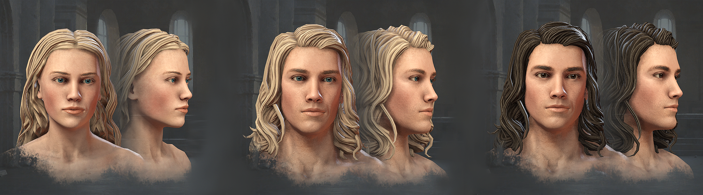
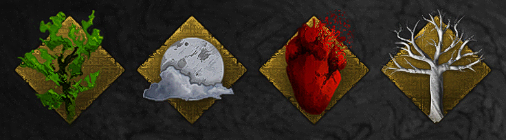

As William the Conqueror took the English Crown from Harold Godwinson, as Genghis Khan laid the foundations for the largest contiguous empire in history and as Constantinople fell to the cannons of Sultan Mehmed II, marking the end of the once believed 'eternal' Roman Empire, there were creatures of both great and terrible power, manipulating the events of man, lurking in the shadows, hidden in plain sight amongst kings and men alike. 

## Features

- Live in a world of the supernatural
- Discover new events, traits, decisions, cultures and more
- As a witch, follow your destiny as a servant of nature or feed your own ambitions, perform your own magic and write a grimoire to leave to your descendants
- As a vampire, live forever as an Immortal, watch your power increase as you age, sire others them into your family and be a force to reckon with on a battlefield
- As a werewolf, beware what activates the curse and stay together to increase your strength through numbers
- As well as more supernatural species
- More to be discovered as you play

## Screenshots

## Special Video

https://user-images.githubusercontent.com/72232634/171426674-cff60a39-0b95-441a-af98-80667446deb0.mp4
