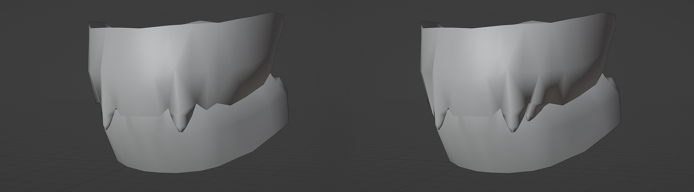

As William the Conqueror took the English Crown from Harold Godwinson, as Genghis Khan laid the foundations for the largest contiguous empire in history and as Constantinople fell to the cannons of Sultan Mehmed II, marking the end of the once believed 'eternal' Roman Empire, there were creatures of both great and terrible power, manipulating the events of man, lurking in the shadows, hidden in plain sight amongst kings and men alike. 

The Old World is a modification for Crusader Kings III, a grand strategy game set in the Middle Ages, developed by Paradox Development Studio and published by Paradox Interactive as a sequel to Crusader Kings and Crusader Kings II. The mod is based on the television universe of the Originals, set between the years of 867 and 1493. Alongside the normal features of Crusader Kings III, you will now be able to play as a supernatural creature with much more to be discovered. However, the life of a person in the Middle Ages was not easy, even if you held supernatural power. There are risks for those who know what you are, and to yourself.

## Features

- Live in a world of the supernatural
- Discover new events, traits, decisions, cultures and more
- As a witch, follow your destiny as a servant of nature or feed your own ambitions, perform your own magic and write a grimoire to leave to your descendants
- As a vampire, live forever as an immortal, watch your power increase as you age, sire others into your family and be a force on the battlefield
- As a werewolf, beware what activates the curse and stay together to increase your strength through numbers
- Keep an eye out for more supernatural species, hints and clues, all to be discovered as you play

## Screenshots

